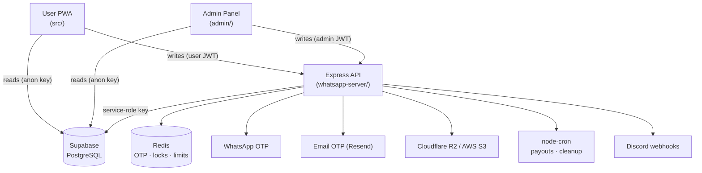

<div align="center">


# Zeloh

### A movie-investment & rewards platform — deposit, invest in movie "tickets", earn daily ROI, and build a referral network.

<br/>


<br/><br/>


</div>

<br/>


## About

**Zeloh** is a full-stack, mobile-first "earn" platform built around a movie-investment theme. Users deposit USDT, purchase movie *tickets* that mature into principal + profit on a daily cycle, complete gamified tasks for vouchers, and earn multi-level commissions from their referral team. A separate admin panel manages content, users, deposits, and withdrawals, while a hardened Node backend handles every money-moving operation atomically.

The codebase ships with **bank-grade security hardening** (atomic balance RPCs, per-user Redis locks, JWT revocation, timing-safe auth, strict rate limiting) and a **time-compression test mode** that lets the full deposit → invest → payout lifecycle be tested in minutes.

<br/>


## Project Context

> This was a **paid freelance project built for a client**.
>
> It was **completely "vibecoded"** — designed, architected, and implemented end-to-end using a mix of different AI coding tools — and delivered in **just 4 days**. It's published here as a portfolio piece to showcase shipping a complete, production-grade, security-hardened full-stack product on a tight timeline.

<br/>


## Features

| | |
|---|---|
|  **Mobile-first PWA** | React + Vite single-page app with a native-app feel and bottom navigation |
|  **Dual OTP auth** | Sign-up/login verified via **WhatsApp** (`whatsapp-web.js`) or **Email** (Resend) |
|  **Movie ticket investing** | Buy tickets with balance or vouchers; auto-payout of principal + profit on maturity |
|  **Product investments** | Longer-term products with configurable ROI %, duration, and global timers |
|  **Multi-level referrals** | Referral team earnings, masked downline reporting, cascading VIP levels |
|  **VIP membership tiers** | Auto-computed from deposits + qualified referrals; unlock higher daily limits & profit % |
|  **Daily tasks & vouchers** | Gamified task progress that awards vouchers usable for ticket purchases |
|  **Deposits & withdrawals** | Crypto recharge with screenshot proof + admin-approved withdrawals with funding password |
|  **Admin dashboard** | Full CRUD for movies, banners, news, users, balances, and approvals |
|  **Discord alerts** | Real-time webhook notifications for registrations, deposits, and withdrawals |

<br/>


## Tech Stack

| Layer | Technologies |
|---|---|
| **Frontend (User + Admin)** | React 18, Vite 5, React Router 6, Tailwind CSS 3, Recharts, React Markdown |
| **Backend API** | Node.js, Express, Helmet, express-rate-limit |
| **Database** | Supabase (PostgreSQL) with `SECURITY DEFINER` RPCs |
| **Auth** | JWT (HS256) + bcrypt, token-version revocation |
| **Cache / Locks** | Redis (`ioredis`) — OTP store, rate limits, per-user locks |
| **Messaging** | WhatsApp (`whatsapp-web.js`) + Email (Resend) |
| **Storage / CDN** | Cloudflare R2 (S3-compatible) + AWS S3 |
| **Jobs** | `node-cron` scheduled payouts & cleanup |

<br/>


## Architecture



**Key principle:** the frontends read public data directly from Supabase, but **every state-changing or money operation is routed through the Express API**, which holds the Supabase service-role key and performs all validation, atomic balance mutations, and rate limiting.

<br/>


## Project Structure

```
.
├── src/                    # User-facing PWA (React + Vite)
│   ├── screens/            # Route screens (Home, Movies, Invest, Recharge, Withdraw, …)
│   ├── components/         # Shared UI (BottomNav, Toast, ErrorBoundary)
│   ├── hooks/              # useAuth, useStatusBarColor
│   └── lib/                # Supabase client, invite helpers
├── admin/                  # Admin dashboard (separate React + Vite app)
│   └── src/
│       ├── pages/          # Dashboard, Users, Recharges, Withdrawals, Movies, …
│       ├── components/     # DataTable, Modal, Sidebar, ImageUpload, …
│       └── lib/            # API client
├── whatsapp-server/        # Express backend — the core of the platform
│   └── server.js           # Auth, OTP, money ops, cron jobs, uploads (~3.3k LOC)
├── supabase-schema.sql     # Full PostgreSQL data model (reference)
├── security-migration.sql  # Hardening RPCs + indexes (idempotent)
└── DEPLOYMENT.md           # End-to-end deployment guide (AWS + EC2)
```

<br/>


## Getting Started

### Prerequisites
- Node.js 18+
- A Supabase project (run `supabase-schema.sql` then `security-migration.sql`)
- A Redis instance (local or hosted)

### 1. Backend API

```bash
cd whatsapp-server
npm install
cp .env.example .env      # then fill in your values
npm start                 # first run prints a WhatsApp QR code to scan once
```

### 2. User app

```bash
npm install
cp .env.example .env      # set VITE_SUPABASE_URL, VITE_SUPABASE_ANON_KEY, VITE_API_URL
npm run dev
```

### 3. Admin panel

```bash
cd admin
npm install
cp .env.example .env
npm run dev
```

<br/>


## Environment Variables

**Frontend (`.env`)**

| Variable | Description |
|---|---|
| `VITE_SUPABASE_URL` | Supabase project URL |
| `VITE_SUPABASE_ANON_KEY` | Supabase public anon key |
| `VITE_API_URL` | Base URL of the Express backend |

**Backend (`whatsapp-server/.env`)**

| Variable | Description |
|---|---|
| `SUPABASE_URL` / `SUPABASE_SERVICE_KEY` | Supabase URL + **service-role** key |
| `JWT_SECRET` | 64-byte random secret for signing JWTs |
| `REDIS_HOST` / `REDIS_PORT` / `REDIS_PASSWORD` | Redis connection |
| `RESEND_API_KEY` / `RESEND_FROM` | Email OTP sender |
| `R2_*` / `AWS_*` | Cloudflare R2 + AWS S3 storage credentials |
| `TEST_MODE` / `TEST_MODE_MINUTES` | Time-compression test mode (1 day = N minutes) |

> See [`DEPLOYMENT.md`](DEPLOYMENT.md) for the complete production deployment walkthrough.

<br/>


## Security Highlights

- **Atomic balance ops** — a `deduct_balance` Postgres RPC with row locks prevents race-condition exploits.
- **Per-user Redis locks** serialize concurrent money operations (`withUserLock`).
- **JWT revocation** via a `token_version` claim — password reset or logout invalidates all old tokens.
- **HS256 pinned** on sign + verify to defeat algorithm-confusion attacks.
- **Timing-safe** OTP comparison and constant-time login to prevent user enumeration.
- **Strict rate limiting** on every auth, OTP, recharge, and withdrawal route.
- **Hardened uploads** — MIME allowlist, size caps, extension derived from content (never the filename).
- **Helmet CSP**, strict CORS allowlist, and a 10 KB body cap.

<br/>


## Scheduled Jobs (`node-cron`)

| Job | Schedule | Purpose |
|---|---|---|
| Ticket payouts | 12:00 AM PKT | Credit matured tickets + referral commissions |
| Investment payouts | Hourly | Credit daily ROI, complete finished investments |
| Movie shuffle | With payouts | Rotate featured movie sections |
| Task cleanup | Daily | Purge task-progress rows older than 30 days |

<br/>


## License

Released under the **MIT License**. See [`LICENSE`](LICENSE) for details.

<br/>

<div align="center">


**Designed & built in 4 days · vibecoded with AI · delivered for a client.**

</div>
