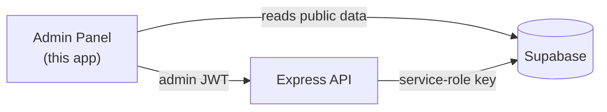

<div align="center">


# Zeloh — Admin Panel

### The control center for the platform: manage users, balances, content, and approve deposits & withdrawals.

<br/>


<br/><br/>


</div>

<br/>


## Overview

A standalone React + Vite single-page app — separate from the user PWA — that operators use to run the Zeloh platform. It authenticates against the backend with an **admin JWT** and talks to the same Express API for every action. All sensitive logic (balance changes, approvals) is enforced server-side; this panel is the operator-facing UI on top of it.



<br/>


## Features

| | |
|---|---|
|  **Dashboard** | Platform metrics — users, deposits, withdrawals, balances at a glance |
|  **Users** | Search users, inspect details, adjust balances, manage wallets, delete accounts |
|  **Recharges** | Review deposit requests with screenshot proof; approve or reject |
|  **Withdrawals** | Approve or reject withdrawal requests |
|  **Movies** | Full CRUD for movie investment products + image uploads |
|  **Investments** | Manage investment products, funding, and global timers |
|  **Banners & News** | Manage homepage banners and news articles |
|  **Notifications & Services** | Broadcast notifications and manage support contacts |
|  **Settings** | Wallet addresses, Discord webhooks, popup config, admin accounts |

<br/>


## Tech Stack

| Concern | Technology |
|---|---|
| UI framework | React 18 |
| Build tool | Vite 5 |
| Routing | React Router 6 (protected routes via `useAdmin`) |
| Styling | Tailwind CSS 3 |
| API | `fetch` wrapper with bearer-token auth ([`src/lib/api.js`](src/lib/api.js)) |

<br/>


## Project Structure

```
admin/
├── src/
│   ├── pages/          # Dashboard, Users, Movies, Recharges, Withdrawals,
│   │                   # Banners, NewsAdmin, NotificationsAdmin,
│   │                   # InvestmentsAdmin, ServicesAdmin, Settings, Login
│   ├── components/      # AdminLayout, Sidebar, TopBar, DataTable, Modal,
│   │                   # ConfirmDialog, StatusBadge, ToastContainer,
│   │                   # ImagePreview, ImageUpload
│   ├── hooks/          # useAdmin (auth/session), useToast
│   ├── lib/            # api.js — authenticated fetch client
│   └── App.jsx         # Routes + RequireAuth guard
└── vite.config.js
```

<br/>


## Getting Started

```bash
cd admin
npm install
cp .env.example .env      # point VITE_API_URL at your backend
npm run dev               # dev server (default http://localhost:5174)
```

Build for production with `npm run build`; preview the build with `npm run preview`.

> The backend ([`whatsapp-server/`](../whatsapp-server/README.md)) must be running for the panel to log in and load data. The very first admin is created once via the backend's `/create-first-admin` endpoint.

<br/>


## Environment Variables

| Variable | Description |
|---|---|
| `VITE_API_URL` | Base URL of the Zeloh backend API (e.g. `http://localhost:3001`) |

<br/>

<div align="center">


**Part of the [Zeloh](../README.md) platform.**
</div>
