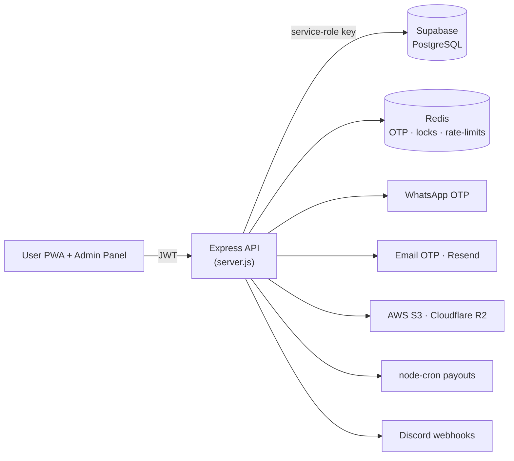

<div align="center">


# Zeloh — Backend API

### The hardened Node.js core that powers everything: auth, OTP, money operations, uploads, and scheduled payouts.

<br/>


<br/><br/>


</div>

<br/>

> **Heads up on the name:** this folder is called `whatsapp-server` for historical reasons — it began life as a standalone WhatsApp OTP sender and grew into the **entire backend** for the Zeloh platform. Every state-changing and money-moving operation in the app flows through this single Express server.

<br/>


## Overview

A single Express application that holds the **Supabase service-role key** and is the only component trusted to mutate balances. The browser apps read public data directly from Supabase, but all writes — registrations, deposits, ticket purchases, withdrawals, investments — are validated, locked, and committed here.



<br/>


## What it handles

| | |
|---|---|
|  **Authentication** | bcrypt password hashing + JWT (HS256) with `token_version` revocation |
|  **Dual OTP** | WhatsApp (`whatsapp-web.js`) and Email (Resend), Redis-backed with attempt blocking |
|  **Money operations** | Deposits, withdrawals, ticket purchases, investments — all atomic & race-safe |
|  **Concurrency control** | Per-user Redis locks serialize balance mutations |
|  **Scheduled jobs** | `node-cron` payouts, investment maturity, movie shuffle, task cleanup |
|  **Uploads** | Recharge screenshots & profile images → AWS S3; admin media → Cloudflare R2 |
|  **Alerts** | Discord webhook notifications for key events |

<br/>


## Tech Stack

| Concern | Library |
|---|---|
| HTTP server | `express`, `cors`, `helmet`, `express-rate-limit` |
| Database | `@supabase/supabase-js` (service role) |
| Cache / locks | `ioredis` |
| Auth | `bcryptjs`, `jsonwebtoken` |
| Messaging | `whatsapp-web.js`, `qrcode-terminal`, `resend` |
| Storage | `aws-sdk` (S3), `@aws-sdk/client-s3` (R2) |
| Jobs / utils | `node-cron`, `multer`, `chalk`, `dotenv` |

<br/>


## API Reference

### Public

| Method | Endpoint | Purpose |
|---|---|---|
| `POST` | `/send-otp` · `/verify-otp` | WhatsApp OTP flow |
| `POST` | `/send-email-otp` · `/verify-email-otp` | Email OTP flow |
| `GET` | `/health` · `/config/test-mode` | Status & runtime config |
| `GET` | `/banners` · `/movies` · `/movies/:id` | Public content |
| `GET` | `/investments` · `/investments/:id` · `/news` · `/news/:id` | Public content |
| `GET` | `/notifications` · `/services` · `/wallet-address/:network` · `/popup-settings` | Public content |

### Auth

| Method | Endpoint | Purpose |
|---|---|---|
| `POST` | `/register` · `/login` | User auth (invite-code gated) |
| `POST` | `/forgot-password/send-otp` · `/forgot-password/verify-otp` | Password reset |
| `POST` | `/create-first-admin` | One-time admin bootstrap |

### User &nbsp;<sub>(`requireAuth`)</sub>

| Method | Endpoint | Purpose |
|---|---|---|
| `GET` | `/me` · `/my-tickets` · `/my-investments` · `/daily-tasks` | Account data |
| `GET` | `/recharge-records` · `/my-withdrawals` · `/account-history` · `/team-earnings` | History |
| `POST` | `/buy-ticket/:movieId` · `/invest-product` | Investing |
| `POST` | `/submit-recharge` · `/submit-withdrawal` | Deposits / withdrawals |
| `POST` | `/set-funding-password` · `/set-wallet` · `/upload-profile-image` | Settings |

### Admin &nbsp;<sub>(`requireAdmin`)</sub>

| Method | Endpoint | Purpose |
|---|---|---|
| `POST` | `/admin/login` | Admin auth |
| `GET/POST/PUT/DELETE` | `/admin/movies` · `/admin/banners` · `/admin/news` · `/admin/services` · `/admin/investments` | Content CRUD |
| `GET` | `/admin/users` · `/admin/users/:id` · `/admin/dashboard` | Users & metrics |
| `POST` | `/admin/users/:id/adjust-balance` · `/admin/recharge/approve\|reject/:id` · `/admin/withdrawal/approve\|reject/:id` | Approvals |
| `POST/PUT` | `/admin/wallet/:network` · `/admin/discord-settings` · `/admin/upload-image` · `/admin/shuffle-movies` | Config |

<br/>


## Security Model

- **Atomic balance debits** — the `deduct_balance` Postgres RPC row-locks the user and checks funds in one transaction (no read-modify-write races).
- **Per-user Redis locks** (`withUserLock`) serialize concurrent money operations.
- **JWT revocation** via a `token_version` claim verified against the DB on every request.
- **HS256 pinned** on sign + verify to defeat algorithm-confusion attacks.
- **Timing-safe** OTP comparison; **constant-time login** (dummy bcrypt hash) prevents user enumeration.
- **Tiered rate limiting** — separate limiters for auth, OTP, register, ticket, recharge, and withdrawal routes.
- **Hardened uploads** — MIME allowlist, 5 MB cap, extension derived from content (never the filename).
- **Helmet CSP**, strict **CORS allowlist**, and a **10 KB** JSON body cap.

<br/>


## Scheduled Jobs (`node-cron`)

| Job | Schedule (prod) | Purpose |
|---|---|---|
| `distributeTicketProfits` | 12:00 AM PKT | Pay matured tickets + 0.04% referral commission |
| `runInvestCron` | Hourly | Credit daily investment ROI, complete finished terms |
| `shuffleMovieSections` | With payouts | Rotate featured movie sections |
| Task progress cleanup | Daily | Delete `user_task_progress` rows older than 30 days |

<br/>


## Test Mode

Set `TEST_MODE=true` to compress time — **one "day" becomes `TEST_MODE_MINUTES` real minutes**. Ticket and investment crons switch to a 30-second cadence so the full deposit → invest → payout lifecycle can be validated in minutes.

> Always set `TEST_MODE=false` before deploying to production.

<br/>


## Getting Started

```bash
cd whatsapp-server
npm install
cp .env.example .env        # fill in your values
npm start                   # first run prints a WhatsApp QR — scan it once
```

The WhatsApp session is saved to `.wwebjs_auth/` (gitignored) so you only scan once; it auto-reconnects on restart. Use `npm run dev` for hot-reload via `nodemon`.

<br/>


## Environment Variables

| Variable | Description |
|---|---|
| `PORT` | Server port (default `3001`) |
| `LOG_LEVEL` | `debug` · `info` · `warn` · `error` |
| `TEST_MODE` / `TEST_MODE_MINUTES` | Time-compression test mode |
| `SUPABASE_URL` / `SUPABASE_SERVICE_KEY` | Supabase URL + **service-role** key |
| `JWT_SECRET` | 64-byte random secret for signing JWTs |
| `REDIS_HOST` / `REDIS_PORT` / `REDIS_PASSWORD` | Redis connection |
| `RESEND_API_KEY` / `RESEND_FROM` | Email OTP sender |
| `ALLOWED_ORIGINS` | Comma-separated CORS origins (dev) |
| `OTP_TTL_SECONDS` / `MAX_WRONG_ATTEMPTS` / `BLOCK_TTL_SECONDS` | OTP tuning |
| `AWS_ACCESS_KEY_ID` / `AWS_SECRET_ACCESS_KEY` / `AWS_REGION` / `AWS_S3_BUCKET` | S3 uploads |
| `R2_ACCOUNT_ID` / `R2_ACCESS_KEY_ID` / `R2_SECRET_ACCESS_KEY` / `R2_BUCKET_NAME` / `R2_PUBLIC_URL` | Cloudflare R2 |

> See the root [`DEPLOYMENT.md`](../DEPLOYMENT.md) for the full production deployment walkthrough.

<br/>

<div align="center">


**Part of the [Zeloh](../README.md) platform.**
</div>
